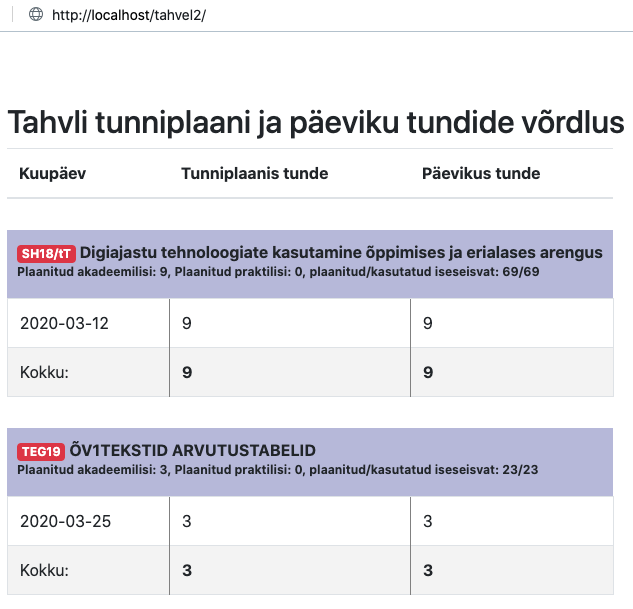

# Projekti ülespanek
## Andmebaasi seadistamine
1. Impordi `doc/database.sql` fail kohalikku MySQL andmebaasi: `mysql -u root doc/database.sql -e "CREATE DATABASE tahvel"` ja `mysql -u root tahvel < doc/database.sql`
1. Kopeeri `config.php.sample` `config.php`ks ja modifitseeri vastavalt vajadusele
## Sõltuvuste paigaldamine
1. Vajadusel paigalda Composer (https://getcomposer.org) ja siis pane oma terminal korraks kinni (ja IDE ka, kui terminali läbi selle avanud oled) 
1. Käivita käsurealt `composer install` projekti kaustas olles 

# Kasutamine
Kuivõrd tahvel.edu.ee'sse peab sisselogima kaheastmeliselt, tuleb meil sinna sisse logida käsitsi ja pärast seda kopeerida saadud sessiooniküpsis.
1. Logi sisse https://tahvel.edu.ee'sse
1. Ava brauseri Network vahekaart
1. Tee üks suvaline päring (kliki mõnda linki lehel)
1. Ava suvaline päring Network vahekaardil
1. Kopeeri `SESSION` küpsise väärtus config.php `TAHVEL_SESSION` väärtuseks
1. Laadi projekti avaleht (http://localhost/tahvel-tunnid vms)
1. Kui Tahvli sessioon aegub, siis tuleb püüda kinni `SESSION` küpsise uus väärtus ja uuendada seda `config.php`s  

